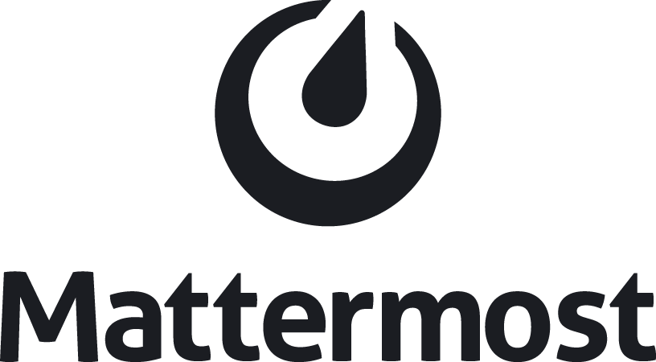

# cochlearis-infra

Multi-cloud infrastructure as code using Terraform.

---

## What We Deploy

Cochlearis provides a complete self-hosted collaboration platform across dev, staging, and production environments.

<table>
<tr>
<td width="120" align="center">

<br/><strong>Zitadel</strong>
</td>
<td>
<strong>Identity & Access Management</strong><br/>
Single sign-on (SSO) for all services. User management, OIDC/OAuth2 provider, MFA support.<br/>
<code>auth.{env}.almondbread.org</code>
</td>
</tr>
<tr>
<td align="center">

<br/><strong>BookStack</strong>
</td>
<td>
<strong>Documentation Wiki</strong><br/>
Organized documentation with books, chapters, and pages. Markdown support, WYSIWYG editor, full-text search.<br/>
<code>docs.{env}.almondbread.org</code>
</td>
</tr>
<tr>
<td align="center">

<br/><strong>Mattermost</strong>
</td>
<td>
<strong>Team Chat</strong><br/>
Slack-alternative with channels, direct messages, file sharing, and integrations. ARM64 compatible.<br/>
<code>mm.{env}.almondbread.org</code>
</td>
</tr>
<tr>
<td align="center">

<br/><strong>Zulip</strong>
</td>
<td>
<strong>Threaded Chat</strong><br/>
Topic-based threading for organized conversations. Better for async communication and searchable history.<br/>
<code>chat.{env}.almondbread.org</code>
</td>
</tr>
</table>

### Environment URLs

| Service | Dev | Staging | Prod |
|---------|-----|---------|------|
| **Zitadel** (SSO) | auth.dev.almondbread.org | auth.staging.almondbread.org | auth.almondbread.org |
| **BookStack** (Docs) | docs.dev.almondbread.org | docs.staging.almondbread.org | docs.almondbread.org |
| **Mattermost** (Chat) | mm.dev.almondbread.org | mm.staging.almondbread.org | mm.almondbread.org |
| **Zulip** (Chat) | chat.dev.almondbread.org | chat.staging.almondbread.org | chat.almondbread.org |

All services authenticate through Zitadel SSO — one login for everything.

---

## Prerequisites

- [Terraform](https://www.terraform.io/downloads) >= 1.7.0
- [tfenv](https://github.com/tfutils/tfenv) (recommended)
- [direnv](https://direnv.net/)
- [aws-vault](https://github.com/99designs/aws-vault)
- [pre-commit](https://pre-commit.com/)
- [terraform-docs](https://terraform-docs.io/)
- [tflint](https://github.com/terraform-linters/tflint)
- [checkov](https://www.checkov.io/)

## Setup

### 1. Clone the repository

```bash
git clone git@github.com:dlf-dds/cochlearis-infra.git
cd cochlearis-infra
```

### 2. Install pre-commit hooks

```bash
pre-commit install
```

### 3. Allow direnv

```bash
direnv allow
```

### 4. Configure aws-vault

```bash
# Add your AWS credentials (one-time)
aws-vault add cochlearis

# Configure longer session duration (recommended for Terraform applies)
# Add to ~/.aws/config under [profile cochlearis]:
#   [profile cochlearis]
#   region = eu-central-1
#   mfa_serial = arn:aws:iam::ACCOUNT_ID:mfa/USERNAME  # if using MFA
#   credential_process =
#   session_duration = 2h
```

### 5. Bootstrap AWS (first time only)

```bash
# Start aws-vault session with 2-hour duration
aws-vault exec cochlearis --duration=2h

# Run bootstrap
./scripts/bootstrap-aws
```

This creates the S3 bucket and DynamoDB table for Terraform state.

## Usage

### Working with environments

```bash
# Always use aws-vault with extended duration for applies
aws-vault exec cochlearis --duration=2h

cd environments/aws/dev
terraform init
terraform plan
terraform apply  # Can take 15-20 minutes
```

### Formatting

```bash
./scripts/format-files
```

### Generating documentation

```bash
./scripts/update-docs
```

## Directory Structure

```
.
├── .github/workflows/     # GitHub Actions CI/CD
├── environments/          # Environment configurations
│   ├── aws/              # AWS environments
│   │   ├── dev/
│   │   ├── staging/
│   │   └── prod/
│   ├── gcp/              # GCP environments (future)
│   └── azure/            # Azure environments (future)
├── modules/              # Reusable Terraform modules
│   ├── aws/              # AWS-specific modules
│   ├── gcp/              # GCP-specific modules (future)
│   ├── azure/            # Azure-specific modules (future)
│   └── common/           # Cloud-agnostic modules
└── scripts/              # Utility scripts
```

## Enabling SSO (One Manual Step Required)

After initial deployment, enable SSO for BookStack, Zulip, and Mattermost:

**⚠️ Manual Step: Create a Service User with PAT in Zitadel**

1. Log into Zitadel: `https://auth.dev.almondbread.org/ui/console`
2. Username: `admin@zitadel.auth.dev.almondbread.org`
3. Get password:
   ```bash
   aws-vault exec cochlearis --no-session -- aws secretsmanager get-secret-value \
     --secret-id cochlearis-dev-zitadel-master-key --region eu-central-1 \
     --query 'SecretString' --output text | jq -r '.admin_password'
   ```
4. Left sidebar → Organization → **Service Users** → **+New**
5. Name: "terraform-bootstrap", grant **ORG_OWNER** role
6. Click the user → scroll to **Personal Access Tokens** → **+New**
7. Copy the token (won't be shown again)

**Automated Steps:**

```bash
cd environments/aws/dev

# Run bootstrap with your PAT
ZITADEL_PAT="your-token-here" ./bootstrap-zitadel-oidc.sh

# Apply with OIDC enabled
terraform apply -var="enable_zitadel_oidc=true"
```

This creates OIDC applications in Zitadel and redeploys services with SSO configured.

See [gotchas.md](gotchas.md) for troubleshooting.

## CI/CD

This repository uses GitHub Actions for CI/CD:

- **terraform-validate.yml**: Runs on all PRs - validates formatting, syntax, and linting
- **terraform-plan.yml**: Runs on PRs to main - generates and posts Terraform plan
- **terraform-apply.yml**: Runs on merge to main - applies changes (prod requires approval)

## Contributing

1. Create a feature branch
2. Make changes
3. Run `pre-commit run --all-files`
4. Open a pull request

---

## Infrastructure Governance

This repository implements a governance framework that should be used as a template for all infrastructure projects. The framework ensures cost control, resource lifecycle management, and operational visibility.

### Tagging Strategy

All resources receive default tags via the AWS provider configuration. These tags are **mandatory** for all infrastructure:

| Tag | Purpose | Example Values |
|-----|---------|----------------|
| `Project` | Groups resources for cost allocation and lifecycle | `cochlearis` |
| `Environment` | Identifies deployment stage | `dev`, `staging`, `prod` |
| `Owner` | Contact email for alerts and accountability | `team@example.com` |
| `ManagedBy` | Tracks how resource was created | `terraform` |
| `Lifecycle` | Controls automatic lifecycle management | `persistent`, `temporary` |
| `Repository` | Links resource to source code | `cochlearis-infra` |

**Optional tags for lifecycle control:**

| Tag | Purpose | Format |
|-----|---------|--------|
| `ExpiresAt` | Explicit expiration date | ISO 8601: `2025-03-01T00:00:00Z` |
| `CreatedAt` | Creation timestamp (for age-based expiry) | ISO 8601: `2025-01-15T12:00:00Z` |

### Resource Lifecycle Management

Resources are managed based on their `Lifecycle` tag:

**`Lifecycle: persistent`** (default)
- Resource lives indefinitely
- No automatic warnings or termination
- Use for production databases, core networking, etc.

**`Lifecycle: temporary`**
- Resource is subject to automatic lifecycle enforcement
- Warning email sent after 30 days
- Auto-terminated after 60 days (if enabled)
- Use for dev/test resources, experiments, demos

**Extending temporary resources:**
```bash
# Option 1: Set explicit expiration date
aws ec2 create-tags --resources i-1234567890abcdef0 \
  --tags Key=ExpiresAt,Value=2025-04-01T00:00:00Z

# Option 2: Convert to persistent
aws ec2 create-tags --resources i-1234567890abcdef0 \
  --tags Key=Lifecycle,Value=persistent
```

### Cost Management

The governance module provides:

1. **Monthly budget alerts** - Notifications at 50%, 80%, 100%, 120% of budget
2. **Weekly cost reports** - Emailed every Monday with spend breakdown by service
3. **Cost forecasting** - Projected monthly spend based on current usage

Configure in `terraform.tfvars`:
```hcl
monthly_budget_limit    = 200   # USD
owner_email            = "team@example.com"
enable_auto_termination = true  # Set false to only alert, not terminate
```

### Applying to New Projects

When creating new infrastructure projects, follow this pattern:

1. **Copy the governance module** to your project's `modules/` directory

2. **Configure provider default tags** in each environment:
   ```hcl
   provider "aws" {
     default_tags {
       tags = {
         Project     = var.project
         Environment = var.environment
         Owner       = var.owner_email
         ManagedBy   = "terraform"
         Lifecycle   = "persistent"
       }
     }
   }
   ```

3. **Include the governance module** in each environment:
   ```hcl
   module "governance" {
     source = "../../../modules/aws/governance"

     project                    = var.project
     environment                = var.environment
     owner_email                = var.owner_email
     monthly_budget_limit       = var.monthly_budget_limit
     enable_auto_termination    = var.enable_auto_termination
   }
   ```

4. **Override lifecycle for temporary resources**:
   ```hcl
   resource "aws_instance" "experiment" {
     # ...
     tags = {
       Lifecycle = "temporary"
       ExpiresAt = "2025-03-01T00:00:00Z"
     }
   }
   ```

### Environment-Specific Recommendations

| Environment | `Lifecycle` Default | Auto-Terminate | Budget |
|-------------|---------------------|----------------|--------|
| dev | `temporary` | Yes | Low ($50-200) |
| staging | `persistent` | No | Medium ($200-500) |
| prod | `persistent` | No | As needed |

### Alerts and Notifications

All governance alerts are sent via SNS to the configured `owner_email`. Alert types:

- **Budget threshold reached** - Immediate notification
- **Resource expiring soon** - 30 days before expiration
- **Resource expired** - Requires action or will be terminated
- **Weekly summary** - Cost report and resource status

To add additional subscribers:
```hcl
resource "aws_sns_topic_subscription" "additional" {
  topic_arn = module.governance.sns_topic_arn
  protocol  = "email"
  endpoint  = "additional@example.com"
}
```

---

## Addendum: Multi-Cloud Identity Access Patterns

Secure credential management for each cloud provider without storing long-lived secrets.

### AWS

Use [aws-vault](https://github.com/99designs/aws-vault) for secure credential management with STS temporary tokens:

```bash
# Add credentials to secure keychain (one-time)
aws-vault add cochlearis

# Execute commands with temporary credentials (use --duration for long operations)
aws-vault exec cochlearis --duration=2h -- terraform apply

# Or start a subshell with extended duration
aws-vault exec cochlearis --duration=2h
```

**IAM operations and `--no-session`**: If you encounter `InvalidClientTokenId` errors when creating IAM roles, users, or policies, use the `--no-session` flag:

```bash
# Use --no-session for Terraform operations that create IAM resources
aws-vault exec cochlearis --no-session -- terraform apply
```

This bypasses STS session tokens and uses raw IAM credentials directly. The issue occurs because aws-vault generates session tokens via regional STS endpoints, but IAM is a global service that sometimes rejects these regional tokens. The `--no-session` flag avoids this by using your IAM credentials without wrapping them in an STS session.

**For CI/CD**: Use OIDC with IAM roles (no secrets stored):

```yaml
# GitHub Actions example
permissions:
  id-token: write
steps:
  - uses: aws-actions/configure-aws-credentials@v4
    with:
      role-to-assume: arn:aws:iam::123456789:role/github-actions
      aws-region: eu-central-1
```

### GCP

Use `gcloud` CLI with Application Default Credentials (ADC) - no additional tools needed:

```bash
# Login once (opens browser, caches credentials securely)
gcloud auth application-default login

# Set default project
gcloud config set project my-project

# Terraform/SDK automatically uses these credentials
terraform plan
```

**For service account impersonation** (recommended for elevated privileges):

```bash
gcloud auth application-default login \
  --impersonate-service-account=terraform@project.iam.gserviceaccount.com
```

**For CI/CD**: Use Workload Identity Federation (keyless auth):

```yaml
# GitHub Actions example
- uses: google-github-actions/auth@v2
  with:
    workload_identity_provider: projects/123/locations/global/workloadIdentityPools/github/providers/github
    service_account: terraform@project.iam.gserviceaccount.com
```

### Azure

Use `az` CLI with built-in credential caching:

```bash
# Login once (opens browser, caches credentials securely)
az login

# Set default subscription
az account set --subscription "My Subscription"

# Terraform/SDK automatically uses these credentials
terraform plan
```

**For service principal impersonation**:

```bash
az login --service-principal \
  --username $ARM_CLIENT_ID \
  --password $ARM_CLIENT_SECRET \
  --tenant $ARM_TENANT_ID
```

**For CI/CD**: Use OIDC with Service Principal (no secrets stored):

```yaml
# GitHub Actions example
- uses: azure/login@v2
  with:
    client-id: ${{ secrets.AZURE_CLIENT_ID }}
    tenant-id: ${{ secrets.AZURE_TENANT_ID }}
    subscription-id: ${{ secrets.AZURE_SUBSCRIPTION_ID }}
```

### Comparison

| Feature | AWS | GCP | Azure |
|---------|-----|-----|-------|
| CLI tool | aws-vault | gcloud | az |
| Credential storage | OS keychain | OS keyring | OS keyring |
| Session duration | 1-12 hours (configurable) | 1 hour (auto-refresh) | 1 hour (auto-refresh) |
| MFA support | Yes (via STS) | Yes (via gcloud) | Yes (via az) |
| Keyless CI/CD | OIDC + IAM roles | Workload Identity Federation | OIDC + Service Principal |

### Best Practices

1. **Never store long-lived credentials** - Use temporary tokens and OIDC where possible
2. **Use least privilege** - Create dedicated roles/service accounts for Terraform
3. **Enable MFA** - Require MFA for interactive sessions
4. **Audit access** - Enable CloudTrail (AWS), Cloud Audit Logs (GCP), or Activity Log (Azure)
5. **Rotate credentials** - If using service account keys, rotate them regularly
